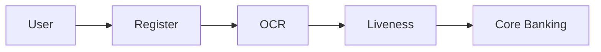

# HW02 - Tài liệu SRS

## Prompt
Sinh tài liệu SRS chuẩn IEEE từ kết quả BA.

## 1. Introduction
- Purpose
- Scope
- Definitions: eKYC, OCR, Liveness.

## 2. Overall Description
- Product Perspective
- User Classes
- Constraints

## 3. Functional Requirements
- Registration
- OCR
- Face Verification
- Account Activation

## 4. Non-functional
- Security
- Performance
- Availability

## 5. Mermaid

